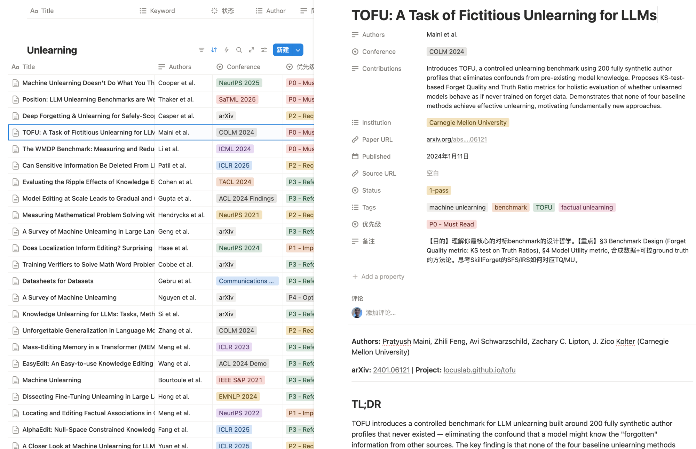
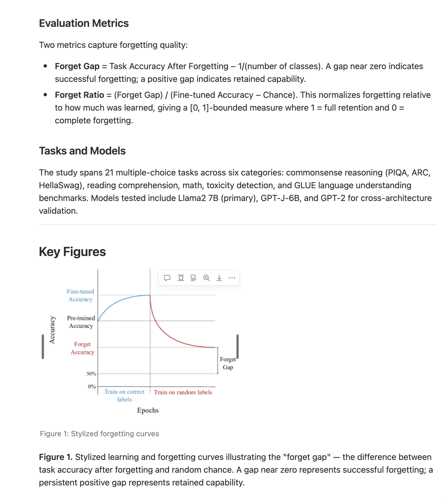

<p align="center">
  
</p>

<h1 align="center">Scholars-Attendant (书僮)</h1>

<p align="center">
  <em>Your research & scientific reading assistant — our loyal servant awaits your command, my liege.</em>
</p>

<p align="center">
  
</p>

An [OpenClaw](https://github.com/openclaw/openclaw) plugin that automatically detects research paper URLs, extracts structured metadata, and provides a full paper analysis pipeline — from quick saves to richly formatted Notion blog pages.

## Showcase

### Paper Archive in Notion

Papers are automatically organized in a Notion database with metadata, tags, conference info, and reading priority:

<p align="center">
  
</p>

### Generated Summary with Figures

Each paper gets a comprehensive blog-style summary with TL;DR, verbatim abstract, method analysis with equations, key figures, and references:

<p align="center">
  
</p>

## Quick Start

```bash
# 1. Clone
git clone https://github.com/Nagi-having-fun/Scholars-Attendant.git
cd Scholars-Attendant

# 2. Install (no build step needed — OpenClaw runs TypeScript via jiti)
npm install --omit=dev

# 3. Set your Notion API token
export NOTION_API_TOKEN=ntn_your_token_here

# 4. Register as an OpenClaw plugin
openclaw plugin add ./path/to/Scholars-Attendant

# 5. Create the Notion database (one-time setup)
#    Share a Notion page with your integration first, then use notion_setup tool
```

### Docker Setup

```yaml
services:
  openclaw:
    environment:
      NOTION_API_TOKEN: ${NOTION_API_TOKEN}
      ANTHROPIC_API_KEY: ${ANTHROPIC_API_KEY}  # Required for API mode
    volumes:
      - ./path/to/Scholars-Attendant:/app/extensions/paper-collector
```

### Standalone Usage (without OpenClaw)

```typescript
import { createExtractPaperFiguresTool } from "./src/notion-tools.js";

// Extract validated figure URLs from any arXiv paper
const tool = createExtractPaperFiguresTool({ logger: console });
const result = await tool.execute("call-1", { arxiv_id: "2410.08827" });
// Returns only figures ≥10KB, validated via HEAD request
```

## Features

- **Multi-platform URL detection**: arXiv, Xiaohongshu, WeChat, X/Twitter, GitHub, and more
- **Image-based paper inference**: Analyzes screenshots and diagrams to identify papers from social media
- **Structured metadata extraction**: Title, authors, institutions, summary, contributions, tags
- **AlphaXiv integration**: Fetch AI-generated structured overviews for arXiv papers
- **Formula & table parsing**: LaTeX equations with correct formatting and tables with proper structure
- **Figure extraction with validation**: ar5iv → arXiv HTML → PDF screenshots, with ≥10KB size validation
- **Blog-style Notion pages**: KaTeX equations, embedded figures, tables, references (Lilian Weng style)
- **Chinese translation sub-pages**: Full translation as child page (same figures, tables, equations)
- **Quality gate enforcement**: Rejects content under 40 blocks or with broken/tiny images
- **Dual execution mode**: API mode (AI API calls) or Agent mode (hosting LLM generates content)
- **Model selection**: Choose from Anthropic, OpenAI, Google Gemini, or DeepSeek models
- **Image toggle**: Generate summaries with or without figures

## Execution Modes

| Mode | Config | How It Works |
|------|--------|-------------|
| **Agent** (default) | `"mode": "agent"` | Hosting LLM agent generates content, calls tools |
| **API** | `"mode": "api"` | Plugin calls AI APIs directly via `generate_paper_summary` |

### Model Selection

Both modes support configurable model selection:

```json
{
  "mode": "api",
  "model": "claude-sonnet-4-6",
  "includeImages": true
}
```

**Available models:**

| Provider | Models |
|----------|--------|
| Anthropic | `claude-opus-4-6`, `claude-sonnet-4-6`, `claude-haiku-4-5-20251001` |
| OpenAI | `gpt-5.4`, `gpt-4.1`, `gpt-4.1-mini`, `o3`, `o4-mini` |
| Google | `gemini-2.5-pro`, `gemini-2.5-flash`, `gemini-2.0-flash` |
| DeepSeek | `deepseek-chat`, `deepseek-reasoner` |

### Image Toggle

Set `"includeImages": false` to skip figure extraction and generate text-only summaries (faster processing).

## Skills

| Skill | Description |
|-------|-------------|
| **paper-collector** | Core workflow: detect paper URLs, extract metadata, save to Notion |
| **alphaxiv-lookup** | Fetch structured AI-generated paper overviews from alphaxiv.org |
| **paper-parse** | Extract formulas, symbols, and tables with correct LaTeX formatting |
| **paper-figures** | Extract and validate paper figures with multi-source fallback |
| **paper-to-notion** | Convert paper into blog-style Notion page + Chinese translation |

### Workflow

```
User sends a paper URL
        │
        ▼
  paper-collector          ← Auto-detect, extract metadata, save to Notion DB
        │
        ▼
  extract_paper_figures    ← Validate figure URLs (≥10KB, reachable)
        │                     Fallback: PDF browser screenshots
        ▼
  notion_write_page        ← English blog page (≥40 blocks, validated images)
        │                     TL;DR, verbatim abstract, method, results, references
        ▼
  notion_create_child_page ← Chinese translation (full mirror, NOT a summary)
        │
        ▼
  Reply to user            ← Title, authors, Notion link, stats
```

## Tools

| Tool | Description |
|------|-------------|
| `notion_save_paper` | Save paper metadata to Notion |
| `notion_batch_save` | Batch save with deduplication and rate limiting |
| `notion_setup` | One-time database creation |
| `extract_page_images` | Extract image URLs from HTML |
| `extract_paper_figures` | Validate figure URLs from ar5iv/arXiv HTML (≥10KB) |
| `notion_write_page` | Write blog content with quality gates |
| `notion_create_child_page` | Create Chinese translation sub-page |
| `generate_paper_summary` | **(API mode only)** One-step: fetch → generate → write |

## Notion Database Schema

| Property | Type | Description |
|----------|------|-------------|
| Title | Title | Paper title |
| Authors | Rich Text | Author names |
| Institution | Multi-select | Author affiliations |
| Published | Date | Publication date |
| Source URL | URL | Original URL |
| Paper URL | URL | arXiv/DOI link |
| Summary | Rich Text | One-sentence summary |
| Contributions | Rich Text | Main contributions |
| Tags | Multi-select | Research area tags |
| Conference | Select | Venue with year |
| Status | Select | Unread / Reading / Read |
| Notes (备注) | Rich Text | Personal reading notes |

## Project Structure

```
├── index.ts                  # Plugin entry point — registers tools by mode
├── openclaw.plugin.json      # Plugin manifest with config schema
├── package.json
├── docs/images/              # README images
├── src/
│   ├── config.ts             # Configuration parser
│   ├── types.ts              # Types + AVAILABLE_MODELS registry
│   ├── ai-client.ts          # Multi-provider AI API client
│   ├── api-mode-tools.ts     # API mode: generate_paper_summary tool
│   ├── notion-client.ts      # Notion API wrapper
│   ├── notion-tools.ts       # Core tool definitions with quality gates
│   ├── markdown-to-blocks.ts # Markdown → Notion block converter
│   └── image-extract.ts      # HTML image URL extraction
└── skills/
    ├── paper-collector/      # URL detection + metadata extraction
    ├── alphaxiv-lookup/      # AlphaXiv paper overview
    ├── paper-parse/          # Formula & table extraction
    ├── paper-figures/        # Figure extraction + validation
    └── paper-to-notion/      # Blog-style Notion page generation
```

## Requirements

- Node.js 22+ or Bun
- [OpenClaw](https://github.com/openclaw/openclaw) (for plugin mode)
- [Notion integration token](https://www.notion.so/my-integrations)
- AI API key (for API mode): Anthropic, OpenAI, Google, or DeepSeek

## License

MIT
